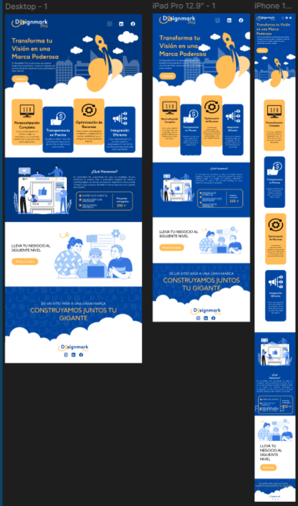
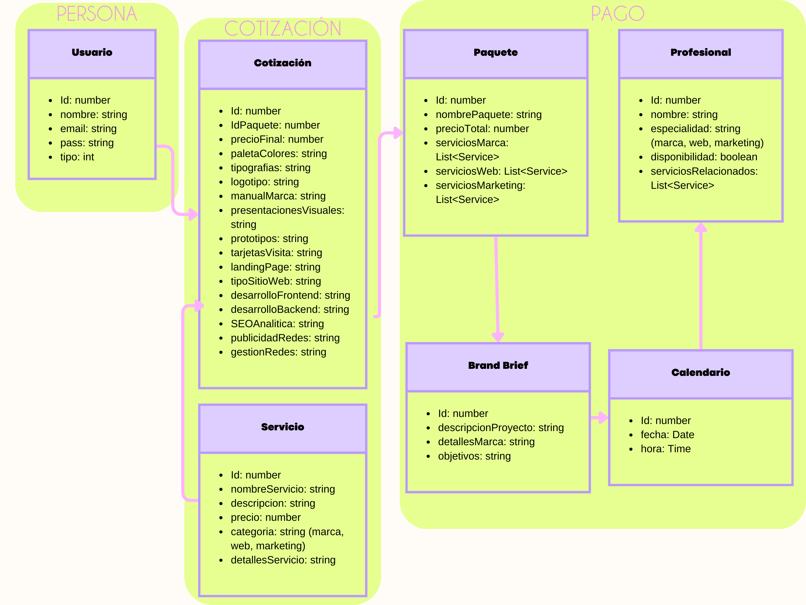

<div align="center"> 
<strong><h1>✨ DesignMark Pro ✨</h1></strong>

<a name="readme-top"></a>

[![React][react-badge]][react-url]
[![Tailwind][tailwind-badge]][tailwind-url]
[![NodeJS][node-badge]][node-url]
[![MySQL][mysql-badge]][mysql-url]
[![Vite][vite-badge]][vite-url]
[![GitHub][github-badge]][github-url]

<br><br>

<a href="https://github.com/angieli13/DESIGNMARK-PRO" target="_blank" rel="noopener noreferrer">
  
</a>

<br><br>


</div>

---

## 📎 Descripción

**DesignMark Pro** es una aplicación web desarrollada con **React.js**, **Tailwind CSS**, **Node.js** y **MySQL**, enfocada en la creación y personalización de paquetes de servicios de diseño y marketing digital.  
Permite a los usuarios **registrarse, iniciar sesión, seleccionar servicios, generar cotizaciones y agendar reuniones virtuales**.  

El proyecto combina una **interfaz moderna y responsive** con una base de datos MySQL conectada mediante Express, logrando una arquitectura escalable y eficiente.  
Fue desarrollado aplicando **metodologías ágiles (SCRUM)**, con **Jira** para la gestión de tareas y **Figma** para el prototipo visual.

---

## 🗂️ Índice

- [🚀 Tech Stack](#-tech-stack)
- [⚙️ Instalación y ejecución](#-instalación-y-ejecución)
- [📋 Tablero Jira - Fases del proyecto](#-tablero-jira---fases-del-proyecto)
- [🎨 Prototipo en Figma](#-prototipo-en-figma)
- [🧩 Diagrama del modelo de dominio](#-diagrama-del-modelo-de-dominio)
- [🗃️ Estructura del proyecto](#-estructura-del-proyecto)
- [👩‍💻 Contacto](#-contacto)
- [🧾 Licencia](#-licencia)

---

## 🚀 Tech Stack

- [![React][react-badge]][react-url] → Desarrollo del frontend interactivo y modular.  
- [![Tailwind][tailwind-badge]][tailwind-url] → Estilos modernos, rápidos y responsive.  
- [![NodeJS][node-badge]][node-url] → Backend con Express y API REST.  
- [![MySQL][mysql-badge]][mysql-url] → Base de datos relacional para gestión de usuarios.  
- [![Vite][vite-badge]][vite-url] → Entorno de desarrollo rápido.  
- [![GitHub][github-badge]][github-url] → Control de versiones y despliegue.  

<p align="right">(<a href="#readme-top">🔝 Volver al inicio</a>)</p>

---

## ⚙️ Instalación y ejecución

1️⃣ **Clonar el repositorio**
```bash
git clone https://github.com/angieli13/DESIGNMARK-PRO.git
cd DESIGNMARK-PRO
2️⃣ Instalar dependencias

bash
Copiar código
npm install
3️⃣ Ejecutar el servidor (backend)

bash
Copiar código
npm run server
4️⃣ Ejecutar el cliente (frontend)

bash
Copiar código
npm run dev
El cliente corre en: http://localhost:5173
El servidor API corre en: http://localhost:5000

<p align="right">(<a href="#readme-top">🔝 Volver al inicio</a>)</p>
📋 Tablero Jira - Fases del proyecto
El progreso de DesignMark Pro fue gestionado con la metodología SCRUM usando Jira Software.
Se documentaron las fases de planificación, diseño, desarrollo, pruebas y entrega.

📌 Accede al tablero aquí:
👉 Ver tablero del proyecto en Jira

<p align="right">(<a href="#readme-top">🔝 Volver al inicio</a>)</p>
🎨 Prototipo en Figma
El diseño UI/UX fue creado en Figma, definiendo la estructura visual, paleta de colores, tipografías y componentes principales antes del desarrollo.

📌 Ver el prototipo aquí:
👉 Prototipo Figma - DesignMark Pro

<p align="center">  </p> <p align="right">(<a href="#readme-top">🔝 Volver al inicio</a>)</p>
🧩 Diagrama del modelo de dominio
El siguiente diagrama representa las entidades principales del sistema: Usuarios, Servicios, Paquetes y Reuniones, así como sus relaciones dentro de la base de datos.

<p align="center">  </p> <p align="right">(<a href="#readme-top">🔝 Volver al inicio</a>)</p>
🗃️ Estructura del proyecto
La arquitectura de DesignMark Pro está dividida en backend, frontend y recursos compartidos para mantener orden y escalabilidad.

bash
Copiar código
DESIGNMARK-PRO/
│
├── public/
├── server/
│   ├── database.js
│   └── index.js
│
├── src/
│   ├── assets/
│   │   └── images/
│   ├── components/
│   │   ├── LoginPage.jsx
│   │   ├── PackagesPage.jsx
│   │   ├── Home.jsx
│   │   ├── Services.jsx
│   │   ├── WhatWeDo.jsx
│   │   ├── Configurator.jsx
│   │   ├── BuildYourGiant.jsx
│   │   ├── CalendlyPage.jsx
│   │   └── Footer.jsx
│   ├── Styles/
│   ├── utils/
│   ├── App.jsx
│   └── main.jsx
│
├── .env
├── .gitignore
├── package.json
├── tailwind.config.js
├── vite.config.js
└── README.md
📘 Descripción breve:

server/ → Conexión MySQL y lógica del backend.

src/components/ → Componentes de interfaz React.

src/assets/ → Imágenes y recursos gráficos.

src/Styles/ → Estilos globales en Tailwind.

.env → Variables de entorno.

vite.config.js → Configuración del entorno.

<p align="right">(<a href="#readme-top">🔝 Volver al inicio</a>)</p>
👩‍💻 Contacto
Angie Martínez
Desarrolladora Frontend & UX/UI Designer
📧 angiequimica13@gmail.com
🌐 GitHub - angieli13
💼 LinkedIn - Angie Combita

<p align="center">  </p> <p align="right">(<a href="#readme-top">🔝 Volver al inicio</a>)</p>
🧾 Licencia
Este proyecto fue desarrollado con fines educativos y de práctica profesional.
© 2025 DesignMark Pro – Todos los derechos reservados.